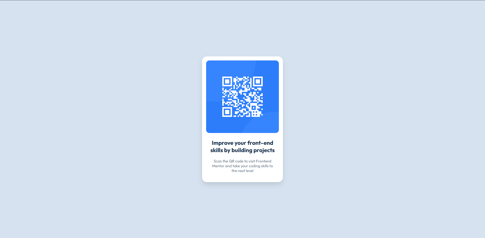

# Frontend Mentor - QR code component solution

## Table of contents

- [Overview](#overview)
  - [Screenshot](#screenshot)
  - [Links](#links)
- [My process](#my-process)
  - [Built with](#built-with)
  - [Useful resources](#useful-resources)
- [Author](#author)

## Overview

### Screenshot

### Links

- Solution URL: [See how it turned out!](https://arturalencar.github.io/qr-code-component-main/)

## My process

### Built with

- Semantic HTML5 markup
- CSS custom properties

### Useful resources

- [Web.dev - Flexbox](https://web.dev/learn/css/flexbox?hl=pt) - This helped me to understand flexible layout and how to use it in the project. 

## Author

- GitHub - [Artur Alencar](https://github.com/arturalencar)
- Frontend Mentor - [@arturalencar](https://www.frontendmentor.io/profile/arturalencar)
